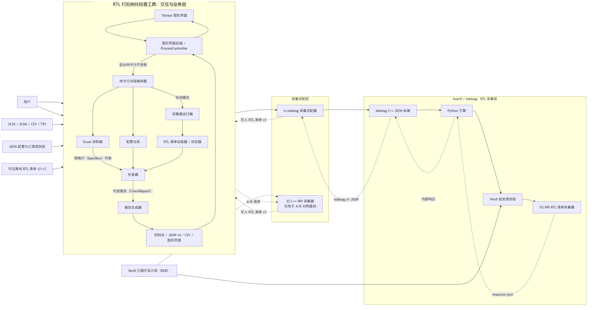
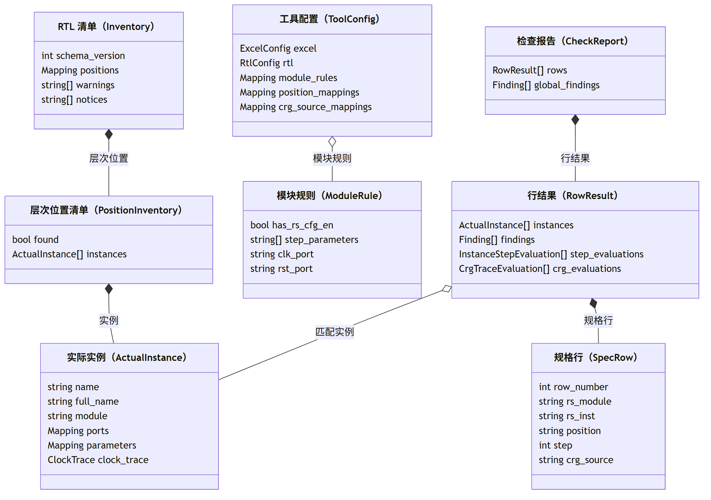
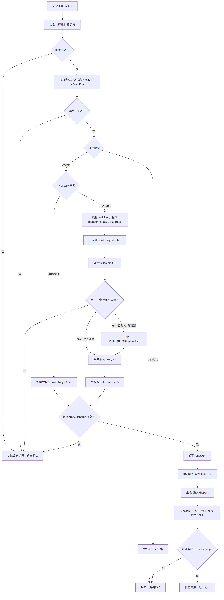
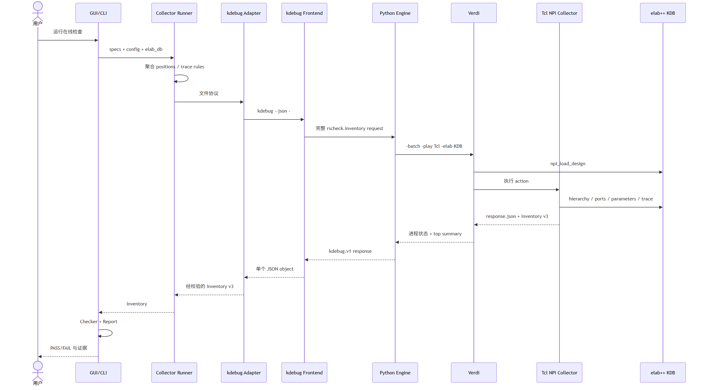
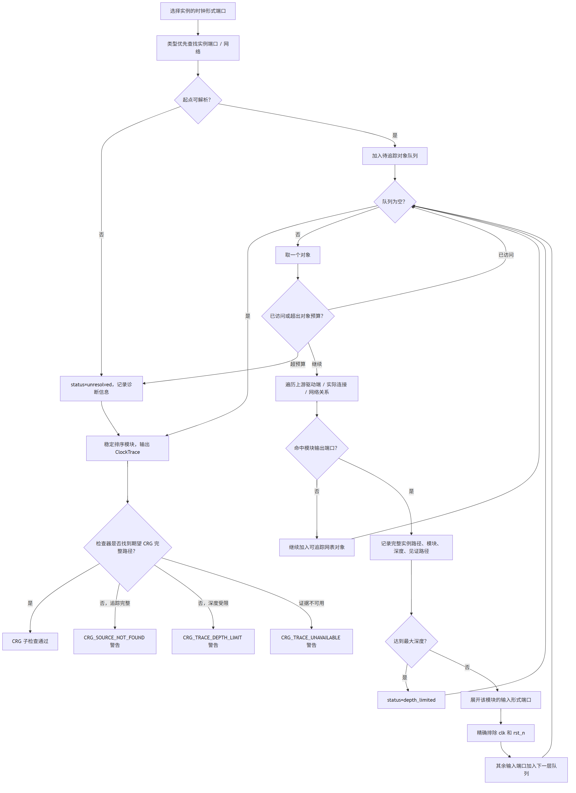
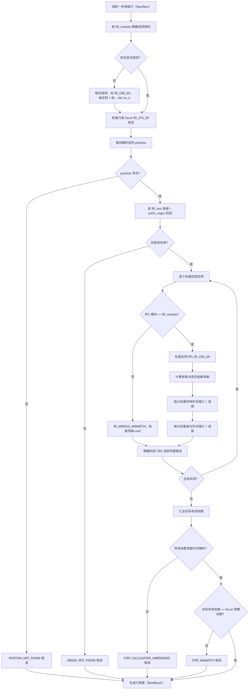
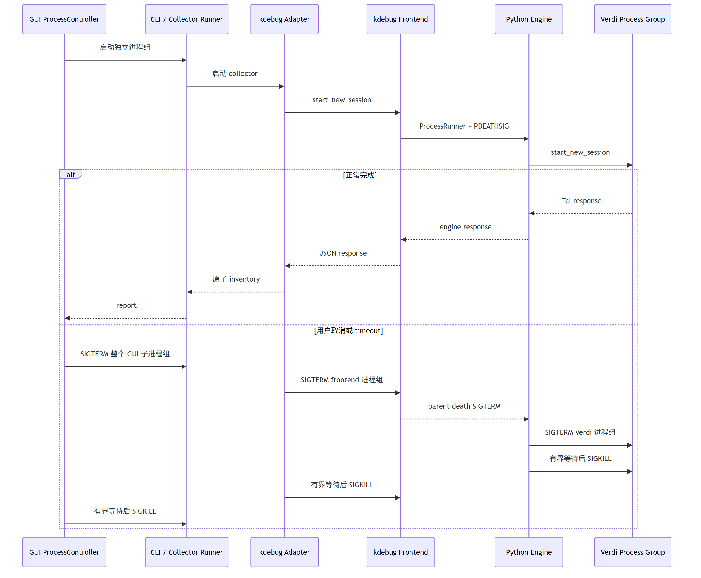

# RTL 打拍例化检查工具设计方案

## 1. 文档说明

本文描述 RTL 打拍例化检查工具的当前设计，包括业务流程、软件架构、数据模型、
kdebug/Verdi 采集链路、检查算法、图形界面、错误模型、进程生命周期和测试策略。

全文采用中文说明。产品名、命令、配置键、结构字段、类名和检查项代码保留原始拼写，
以便与源码、日志和输出文件直接对照。

本文对应的有效行为基线：

| 项目 | 版本 |
| --- | --- |
| `suhua_rs_tool` 功能签核提交 | `dac071109808ea361c17bed68606a9c17e1d3553` |
| `kverif` 功能签核提交 | `2b43b799c8f7f8586a9e6c2128335e74d971e633` |
| RTL 清单 | 结构版本 v3 |
| JSON 报告 | 结构版本 v4 |
| Python 运行环境 | 3.8 或更高版本 |

当前仓库后续提交只增加文档，不改变上述已签核业务行为。

## 2. 背景与目标

芯片设计中，同一条接口可能通过多个 RS 打拍模块实例完成多级打拍。规格维护在
Excel 中，RTL 真实结构则存在于 Verdi 展开后的 KDB。人工检查需要逐行确认实例数量、
模块类型、最终生效参数、时钟/复位连线和上游 CRG 路径，容易遗漏且难以复现。

本工具的目标是：

1. 将 Excel 中的打拍规格归一化为稳定的数据模型。
2. 从已有 Verdi `*.elab++` 中采集可审计的 RTL 结构证据。
3. 按模块规则计算每个实例对 `step` 的实际贡献。
4. 独立检查模块、时钟、复位、`RS_CRG_EN` 和 CRG 路径。
5. 同时提供命令行、Tkinter 图形界面、JSON、CSV 和控制台结果。
6. 支持离线 RTL 清单复查和 Linux 上的在线 KDB 采集。
7. 对部分可用 KDB、超时和取消进行有界、可清理的处理。

### 2.1 非目标

当前版本明确不做以下事情：

- `Intf_type` 只作为报告标签，不验证接口数据内容。
- 不检查各拍数据端口是否首尾串接。
- 不检查第一拍输入或最后一拍输出的数据语义。
- 不把文件列表、RTL 源码或 `work.lib++` 当作在线采集输入。
- 不对复杂时钟/复位表达式进行猜测性解析。
- CRG 追踪证明的是结构可达性，不等价于完整时序语义证明。
- CRG 未命中、深度受限或证据不可用只产生警告，不使整行失败。
- 当前没有“模块天生无复位，因此跳过复位检查”的规则。

## 3. 术语和兼容命名

| 名称 | 设计含义 |
| --- | --- |
| `RS_CFG_EN` | Excel、配置对象和检查项代码中保留的兼容字段名 |
| `RS_CRG_EN` | RTL 中实际需要采集和检查的最终生效参数 |
| `has_rs_cfg_en` | 模块规则的兼容配置键，表示 RTL 是否应存在 `RS_CRG_EN` |
| `position` | RS 实例组所在的 RTL 层次位置；Excel 可填简写 |
| `CRG_source` | 期望到达的上游 CRG 模块完整实例路径；Excel 可填简写 |
| `RS_inst` | 本地实例名前缀，也可填写完整本地实例名 |
| 物理拍数 | 匹配到的物理实例数 |
| 有效拍数 | 按拍数参数规则计算出的实际拍数 |
| 部分可用 KDB | 加载报错但仍至少有一个顶层实例可查询的展开后 KDB |

复位端口默认值存在一个兼容边界：

- 未注册模块的隐式规则固定使用 `clk/rst_n`。
- 新建模块规则的业务默认也是 `clk/rst_n`。
- `rtl.rst_port` 的历史默认仍是 `rst`，仅供旧配置和缺省显式规则迁移兼容。

## 4. 用户场景

### 4.1 图形界面在线检查

用户在工具自带的 Tkinter 图形界面中选择 Excel、配置和 `*.elab++`，编辑三类规则库，
运行检查并查看逐行结果、参数证据和 CRG 见证路径。

### 4.2 命令行在线检查

自动化脚本显式指定 kdebug 适配器和 `*.elab++`。工具在线生成 RTL 清单 v3，
随后执行检查并输出控制台、JSON v4 和可选 CSV。

### 4.3 离线复查

用户加载已有 RTL 清单 v2/v3，跳过 Verdi 采集层，复用同一检查器。离线清单属于用户
信任的快照，不证明它与当前 RTL/KDB 保持同步；生产签核应在线重新采集 v3。

### 4.4 仅验证规格

`validate` 只加载配置并解析 Excel，输出完成列映射和路径映射后的 `SpecRow`，
不需要 RTL 清单或 Verdi。

## 5. 总体架构框图



### 5.1 关键架构决策

| 决策 | 原因 |
| --- | --- |
| 图形界面通过命令行子进程执行 | 图形界面与自动化复用参数、检查器和退出码，避免两套业务逻辑 |
| 采集与检查以 RTL 清单隔离 | Verdi/NPI 证据采集和业务规则可以独立测试、版本化和复查 |
| kdebug 使用外部 JSON 操作 | 主工具与 kdebug ELF 均不直接链接 NPI，NPI 只在 Verdi Tcl 内运行 |
| 一次操作采集全部层次位置 | 避免按 Excel 行或 `position` 反复加载大型 KDB |
| 参数缺失时保守失败 | 无法证明有效拍数时，不使用不完整证据推测结果 |
| CRG 未命中只警告 | 追踪可能被复杂表达式或深度限制截断，不遮蔽其他硬错误 |
| 配置使用单个 JSON 文件 | 方便图形界面/命令行导入导出和跨设备复现，不依赖数据库服务 |

## 6. 模块职责

| 模块 | 主要职责 |
| --- | --- |
| `rscheck/model.py` | 领域模型、结构版本常量、检查项（`Finding`）、用户可见异常 |
| `rscheck/config.py` | 六根配置校验、归一化、序列化和原子保存 |
| `rscheck/excel_reader.py` | XLSX/XML、CSV/TSV 解析和 `SpecRow` 构造 |
| `rscheck/inventory.py` | RTL 清单 v2/v3 反序列化和严格结构校验 |
| `rscheck/npi_runner.py` | 采集器文件协议、临时目录、超时和 RTL 清单加载 |
| `rscheck/kdebug_collector.py` | 采集器文件协议到 `kdebug.v1` JSON 操作的适配 |
| `rscheck/checker.py` | 无文件 I/O 的核心对比算法 |
| `rscheck/reporting.py` | 控制台、JSON v4 和 CSV 输出 |
| `rscheck/cli.py` | 命令行参数、应用编排、数据库增删改查和退出码 |
| `rscheck/gui_backend.py` | 图形界面命令构造、报告防腐校验和跨平台进程控制 |
| `rscheck/gui.py` | Tkinter 页面、配置草稿、导入导出、执行和证据展示 |
| `kdebug` C++ 前端 | 操作注册、公共请求封装/资源和基础必填项校验、引擎转发 |
| `kdebug_engine.py` | 临时文件协议、Verdi 启动、部分加载判定和响应封装 |
| `kdebug_npi.tcl` | Verdi 内 Tcl 操作分发和统一响应 |
| `rscheck_inventory.tcl` | NPI 层次、端口、参数和时钟追踪采集 |

旧 `npi/rs_npi_collector.cpp` 只作为 A/B 对照基线保留，不是当前默认在线后端。

## 7. 配置和输入模型

### 7.1 完整配置

配置文件是一个严格校验的 JSON 文档，不是独立数据库服务。规范化完整配置有且只有
六个根：

| 根节点 | 内容 |
| --- | --- |
| `excel` | 工作表、表头行、数据起始行和可选严格表头检查 |
| `columns` | 九个内部字段到唯一从 1 开始列号的映射 |
| `rtl` | 后缀规则、历史兼容端口、索引和 CRG 深度等通用配置 |
| `position_mappings` | `position` 简写到完整层次路径的精确映射 |
| `crg_source_mappings` | `CRG_source` 简写到完整层次路径的精确映射 |
| `module_rules` | 模块的门控、拍数参数和形式端口规则 |

图形界面完整导入/导出使用 `load_complete_config`，要求六个根全部存在，并覆盖三类规则库；
导出内容不保存 `KDEBUG_BIN`、许可证信息或设备路径。普通 `load_config` 为旧配置保留兼容：
`columns` 仍必须完整，其他缺省区段按默认值或空库补齐，规范化保存后会写出全部六个根。

配置在内存中完成归一化校验后，写入同目录临时文件并用 `os.replace` 替换。图形界面保存单个
规则库时会检测该区段是否被其他进程修改；当前仍是单写者模型，不提供多写者自动合并。

### 7.2 Excel 九个内部字段

| 内部字段 | 行内要求 | 用途 |
| --- | --- | --- |
| `Intf_type` | 必填 | 报告标签，不参与 RTL 判定 |
| `RS_module` | 必填 | 模块规则和 RTL 模块定义的匹配键 |
| `RS_inst` | 必填 | 本地实例名或实例组前缀 |
| `position` | 必填 | RS 实例组所在层次范围，可经映射解析 |
| `step` | 必填非负整数 | 期望有效拍数 |
| `clk` | 必填 | 期望时钟实际连线 |
| `rst` | 必填 | 期望复位实际连线 |
| `CRG_source` | 必填 | 期望上游 CRG 完整实例路径，可经映射解析 |
| `RS_CFG_EN` | 单元格可空 | “假门控”标签或精确 `NA` 跳过标志 |

九个字段都必须配置唯一列号，但 Excel 可包含任意额外列，列可以乱序、不连续，表头也
可以使用任意业务名称。`validate_headers=false` 时不要求表头等于内部字段名。

支持 `.xlsx`、`.xlsm`、`.csv` 和 `.tsv`；不支持旧二进制 `.xls`。全空行被跳过，
部分填写的行会报告所有缺失字段。

### 7.3 映射语义

`position` 和 `CRG_source` 都采用区分大小写的精确一层映射：

```text
Excel 简写 --精确查表--> 完整 RTL 层次路径
未命中       ---------> 按用户已经填写完整路径处理
```

不做模糊匹配、前缀匹配或简写递归展开。`SpecRow` 同时保存简写和解析后的完整值，
用于图形界面、JSON 和 CSV 展示。

## 8. 核心数据模型



### 8.1 证据与结论分离

- `SpecRow` 保存用户期望和解析后的完整路径。
- `Inventory` 只保存 RTL 证据，不写入 `step` 或门控业务结论。
- `InstanceStepEvaluation` 保存每个参数的是否存在、原始值、状态和拍数贡献。
- `CrgTraceEvaluation` 保存目标、追踪状态、匹配节点和诊断。
- `Finding` 统一保存严重级别、代码、期望值、实际值和实例定位。
- `RowResult`、`CheckReport` 才表达通过或失败。

## 9. 端到端主流程图



## 10. 在线采集设计

### 10.1 采集器文件协议

`npi_runner.collect_inventory` 将所有规格行聚合为：

- 去重后的完整层次位置列表。
- 按模块规则生成的“模块到时钟形式端口”追踪规则。
- 全局追踪深度和历史兼容的时钟/复位回退端口。

这些内容写入唯一临时目录，随后只启动一次采集器。采集器返回 RTL 清单 JSON，
执行器重新加载并严格验证后，才允许保存用户指定的 RTL 清单副本。

### 10.2 kdebug JSON 操作

适配器把文件协议转换为单个公共请求：

```json
{
  "api_version": "kdebug.v1",
  "action": "rscheck.inventory",
  "target": {"elab_db": "/abs/path/TB.elab++"},
  "args": {
    "positions": ["top.u_tile"],
    "trace_rules": {"rs_pipe": "clk"},
    "trace_max_depth": 16,
    "clk_port": "clk",
    "rst_port": "rst_n"
  },
  "limits": {"timeout_ms": 58000},
  "output": {"format": "json"}
}
```

`rscheck.inventory` 是 `design` 类稳定操作。C++ 前端负责操作注册、公共请求封装、
设计资源和基础必填项校验，再把完整公共 JSON 交给 Python 引擎；Python 引擎继续校验
操作参数的完整类型、范围和组合约束。该操作的唯一设计资源是绝对路径
`target.elab_db`，不接受文件列表或 Verdi 参数透传。

### 10.3 Python 引擎到 Verdi

Python 引擎在独立临时目录中创建 UTF-8 请求、层次位置、追踪规则和响应文件，
通过受控环境变量把路径交给 Tcl，然后执行：

```bash
verdi -batch -nologo -play <kdebug_npi.tcl> -elab <KDB>
```

Tcl 分发器加载 `rscheck_inventory.tcl`，在 Verdi 进程内部调用 NPI。Tcl 生成内嵌的
RTL 清单 v3；Python 引擎再执行顶层可查询门禁、部分加载判断和响应封装。适配器最后用
主工具自己的 RTL 清单加载器再验证一次，采用临时文件和 `os.replace` 原子写出。

### 10.4 正常调用时序



## 11. NPI 采集算法

### 11.1 `position` 和实例

- 对每个 `position` 做精确层次路径查找。
- 找不到时输出 `found=false`，而不是让整个操作失败。
- 只采集 `position` 的直接模块子实例。
- 生成作用域对遍历透明，嵌套生成作用域中的直接模块会被输出。
- 不下钻普通模块的内部实例，避免把不同归属层级混在一个 `position`。
- 实例按稳定键排序，保证多次运行 JSON 可比较。

### 11.2 形式端口

端口同时使用语言层和网表层证据，单个端口失败不丢弃其他端口。网表名称查找采用
类型优先策略：

1. 形式端口优先 `npiNlInstPort`。
2. 连接对象优先 `npiNlNet`。
3. 模块实例优先 `npiNlInst`。
4. 明确类型失败后才使用 `npiNlUndefined`。

这样可以避免实例、网络和实例端口同名时错误选中实例，并防止 CRG 错误通过。
所有迭代器和拥有所有权的句柄都在对应作用域中释放。

### 11.3 最终生效参数

采集器枚举实例最终生效的参数，并保留可可靠取得的原始字符串。已枚举但无法可靠取值的
参数保存为 `null`；根本没有枚举到的参数则不产生对应键。检查器区分缺失（`missing`）
与无法解析（`unresolved`），再把常见十进制、Verilog 进制字面量、`'0`/`'1` 归一为
`zero/nonzero/unresolved`；两类证据不足都采用从严失败策略。

### 11.4 部分可用 KDB

`npi_load_design` 返回非零不直接决定操作失败。Python 引擎使用 Tcl 返回的顶层实例摘要
作为硬门禁：

- 至少一个顶层实例可查询：保留 RTL 清单，并增加唯一 `NPI_LOAD_PARTIAL` 通知。
- 没有可查询顶层实例：返回结构化 `NPI_LOAD` 操作错误。

部分加载通知只是警告，不会遮蔽层次位置、端口、参数或追踪中的实际硬错误。

## 12. CRG 有界递归追踪

采集器不知道 Excel 期望的 `CRG_source`；它为每个 RS 实例收集指定时钟形式端口可达的
上游模块图。检查器随后用解析后的 `CRG_source` 完整层次路径精确匹配追踪节点。

### 12.1 追踪流程图



### 12.2 有界性和缓存

- 用户最大模块跳数默认 16，可配置范围 1..256。
- 单条追踪另有网表对象预算，防止异常图无限膨胀。
- 使用已访问对象集合终止环路。
- 追踪状态和缓存键包含完整实例层次路径，不按本地名称共享。
- `excluded_inputs` 当前固定为精确小写 `clk`、`rst_n`。
- 见证路径长度必须和深度一致，最后节点必须等于模块实例。

## 13. 单行检查流程



每个错误节点只追加 `Finding` 检查项，不抛弃已经取得的其他证据。所有 `RowResult` 生成后，
`check_specs` 再按 `position + 完整实例层次路径` 汇总归属；同一物理实例被多个 Excel 组
匹配时生成全局 `AMBIGUOUS_GROUP_MATCH` 错误。

### 13.1 RS_inst 分组

- 实例本地名必须以 Excel `RS_inst` 开头。
- 剩余后缀为空时合法，表示用户填写了完整本地实例名。
- 剩余后缀非空时必须完整匹配 `suffix_regex`。
- 后缀规则必须提供 ASCII 数字命名组 `index`，可选检查连续索引。
- 完整名输入不是强制仅精确匹配：若同时存在 `PFX` 和 `PFX_C0`，`RS_inst=PFX`
  可以同时匹配；跨行重复归属会报告歧义。
- 即使 Excel `step=0`，完全没有物理实例仍报告 `GROUP_NOT_FOUND`。

### 13.2 动态拍数

对模块名正确的每个匹配实例：

| 拍数参数状态 | 拍数贡献 |
| --- | --- |
| 没有配置拍数参数 | `1` |
| 所有配置参数都是已知非零 | `1` |
| 全部已解析，且至少一个为零 | `0` |
| 任意一个缺失或无法解析 | `null`，优先级最高，整行从严失败 |

所有拍数贡献可解析时求和，并与 Excel `step` 比较。

### 13.3 门控规则

| 模块规则 / Excel / RTL | 结果 |
| --- | --- |
| Excel `RS_CFG_EN` 精确为 `NA` | 只跳过本行门控标签和 `RS_CRG_EN` 检查 |
| `has_rs_cfg_en=true` | Excel 必须精确为“假门控”，RTL 必须存在可解析且为 0 的 `RS_CRG_EN` |
| `has_rs_cfg_en=false` 且 RTL 无该参数 | Excel 任意内容均不关心 |
| `has_rs_cfg_en=false` 但 RTL 实际存在该参数 | 规则与 RTL 不一致，报告非预期参数错误 |

兼容检查项代码仍使用 `RS_CFG_EN_*`，消息和证据明确指向 RTL `RS_CRG_EN`。

### 13.4 时钟/复位

- 形式端口名来自模块规则，未注册模块使用 `clk/rst_n`。
- Excel `clk/rst` 是期望实际连接，不是形式端口名。
- 时钟和复位完全独立取证；时钟形式端口存在、已连接且匹配，而复位形式端口缺失时，
  只报告 `RST_PORT_MISSING`，不会误报时钟缺失或未连接。
- 空连接报告 `*_UNCONNECTED`。
- 复杂 `Operation` 对象报告 `UNSUPPORTED_CONNECTION`，不进行字符串猜测。
- 默认按规范化完整信号路径匹配；可选旧版叶节点匹配。

## 14. 图形界面设计（GUI）

工具自带图形界面是 Tkinter 应用，不是 Verdi 图形界面。主要页面：

1. 检查配置。
2. 模块规则库。
3. 层次位置映射库。
4. CRG 来源映射库。
5. 检查结果。
6. 运行日志。

### 14.1 状态管理

- 图形界面为三类规则库维护内存草稿、加载基线和未保存修改状态。
- 配置路径改变后必须显式加载，避免使用旧内容写入新文件。
- 完整导入先解析并验证候选配置，确认丢弃未保存草稿后再整体替换。
- 导出前重新验证完整快照，并拒绝覆盖当前配置或输入/输出路径别名。
- 当前在线结果按报告 v4 防腐校验；历史报告 v2/v3 按对应兼容合同只读加载，图形界面
  不直接信任任意 JSON。

### 14.2 后台执行和取消

图形界面不在 Tk 主线程运行检查。`gui_backend` 构造与命令行相同的命令，由
`ProcessController` 启动独立进程组并并发读取标准输出和标准错误。图形界面线程只接收
`WorkerOutcome`，更新日志、摘要、逐行检查项和证据视图。

Linux 图形界面探测可使用当前命令行会话的 X11，也可从桌面/Xwayland/VNC/XRDP 进程
发现显示会话，不依赖 GNOME 或固定用户名。Windows/macOS 支持 `validate` 和离线检查；
在线 Verdi/KDB 采集只支持 Linux。

## 15. 错误、警告、通知和退出码

| 类型 | 示例 | 是否使检查失败 |
| --- | --- | --- |
| 基础设施错误 | 配置、Excel、KDB、采集器或结构错误 | 命令行退出码 `2` |
| 错误检查项 | RTL 与规格硬检查不一致 | 行失败，命令行退出码 `1` |
| 警告检查项 | CRG 未找到、深度受限、证据不可用、后缀标签警告 | 不改变行通过状态 |
| RTL 清单通知 | `NPI_LOAD_PARTIAL` | 转成可见警告，不单独使检查失败 |
| 正常通过 | 无错误检查项 | 命令行退出码 `0` |

RTL 清单中的普通采集器警告默认按从严失败处理；只有明确识别的 CRG 追踪类警告
不升级为全局错误。

## 16. 进程生命周期和原子性

### 16.1 分层超时

在线链路存在多层截止时间：

1. 图形界面默认配置采集器外层超时；命令行仅在传入 `--npi-timeout` 时启用该层。
2. 适配器对 kdebug 前端的硬超时。
3. kdebug 请求传给引擎的更短内部超时。
4. 引擎对 Verdi 的有界超时。

存在用户外层超时时，各内层截止时间依次提前，为响应封装和进程清理保留时间。
命令行未指定外层超时时，适配器仍有 125 秒硬上限，引擎对 Verdi 默认使用 120 秒。

### 16.2 取消/超时序列



Windows 图形界面使用 `taskkill /T /F` 清理子树；POSIX 使用稳定 PGID，主进程先退出后
仍会清扫组内后代。C++ 引擎子进程设置 Linux `PR_SET_PDEATHSIG`，Verdi 使用独立会话。
所有 `communicate()`、`wait()` 和管道读取均有上限。

### 16.3 原子输出

- 配置先完成归一化校验，再写同目录临时文件并原子替换。
- 适配器 RTL 清单和保留的清单副本执行缓冲区刷新、`fsync` 与加载器/结构校验后，
  再原子替换；失败时保留原目标文件。
- 操作临时目录和本次活动会话/注册记录在退出路径清理。
- 用户显式指定或继承的 `KDEBUG_HOME` 不删除，其中日志可保留用于复现。

## 17. 安全与信任边界

- 在线唯一设计输入是已有 `*.elab++` 目录。
- 明确拒绝 `work.lib++`、文件列表、RTL、`-f/-sv/-lib/-top` 和任意 Verdi 参数透传。
- 不执行独立许可证服务器连通性预检，实际 Verdi 负责报告环境问题。
- kdebug ELF 和适配器不链接、不加载 `libNPI/libnpiL1`；NPI 只在 Verdi Tcl 内部运行。
- 用户指定的离线 RTL 清单被视为可信快照，工具只验证结构，不验证来源和新鲜度。
- 配置不保存许可证信息、`KDEBUG_BIN` 或机器专属会话凭据。
- 日志不打印许可证值，不应提交生产 KDB、RTL、Synopsys 文件或设备凭据。
- 所有 JSON/Tcl 交换使用 UTF-8 和 LF；CSV 使用 UTF-8 BOM 便于 Excel 打开。

## 18. 性能设计

主要性能策略：

- 所有 Excel 行先聚合层次位置和追踪规则，一次操作只加载一次 KDB。
- 层次位置去重，实例和追踪输出稳定排序。
- 时钟追踪使用已访问对象集合、模块深度和对象预算三重边界。
- 完整层次路径作为缓存身份，防止不同层次范围的同名逻辑锥互相污染。
- 检查器只进行内存计算，不重复访问 Verdi。
- 图形界面在后台读取标准输出和标准错误，避免大输出填满管道并阻塞子进程。

性能目标不是常驻服务吞吐量，而是单次大型 KDB 检查的稳定性、可取消性和证据完整性。

## 19. 测试策略

| 层级 | 覆盖重点 |
| --- | --- |
| Python 单元测试 | Excel、配置、映射、分组、参数、端口、CRG、报告、图形界面状态 |
| kdebug 引擎单元测试 | 请求准备、UTF-8、部分加载封装、Verdi 超时/取消 |
| Tcl 模拟测试 | NPI 句柄、类型优先查找、参数、分支追踪、环路和编码 |
| C++ 单元测试 | 操作注册、资源、`ProcessRunner`、`PDEATHSIG`、会话路径 |
| JSON 契约测试 | 操作目录、请求/响应结构和示例 |
| 真实 KDB 专项测试 | 正常/部分加载、20 次重载、1 秒超时、运行中取消 Verdi |
| 全新环境图形界面测试 | GitHub 全新检出、可见 Verdi/Tk、专项循环和 10,000 行负载 |

当前有效签核结果：

- 主工具本机：321 项测试通过，50 项因平台条件跳过；Python 二进制包/源码包和隔离用户
  安装通过。
- VM kdebug：Python 35 项通过、Tcl 测试通过、182 个结构文件校验通过、175 个示例文件
  校验通过、C++ 单元测试通过、29 个运行时契约通过。
- 真实 KDB：原始接口/适配器的正常和部分加载测试通过；两个层次位置、26 个实例，
  20/20 次重载通过。
- 超时/取消：确认 Verdi 正在运行后终止前端；1 秒超时后无进程、临时目录、崩溃标记
  或活动会话泄漏。
- 全新环境图形界面：VM 321/321；在线正例 3 轮；CRG 深度限制、时钟存在/复位缺失、
  不关心、`NA`、CRG 映射各 20 轮；图形界面 100 轮；10,000 行负载通过。
- Verdi 窗口明确加载展开后的 `top`，Tk 窗口已完成映射并可见。

## 20. 部署与构建

### 20.1 主工具

```bash
python -m pip install .
rtl-rs-check --help
rtl-rs-check-gui
```

命令行核心没有第三方运行时依赖；图形界面依赖 Python Tk。

### 20.2 kdebug 后端

在对应 `kverif` 检出目录中：

```bash
make -C kdebug -j2 all
PYTHON=python3 make -C kdebug test-fast
export KDEBUG_BIN="$PWD/kdebug/kdebug"
```

`KDEBUG_BIN` 只能指向上述构建生成的 Linux ELF 可执行文件，不能填写
`.c/.cc/.cpp/.cxx` 原始 C++ 文件或 shell/Python 脚本。适配器在加载 KDB 前校验绝对
路径、执行权限和 ELF 文件头，不满足时返回 `KDEBUG_EXEC`。

`ldd "$KDEBUG_BIN"` 不得出现 `libNPI`、`libnpiL1` 或 `not found`。在线运行设备仍然
必须安装合法且与 KDB 兼容的 Verdi/NPI 环境；隔离 NPI API 不等于消除 Verdi 依赖。

## 21. 当前限制和演进方向

### 21.1 当前限制

- 最终真实 VM KDB 签核测试夹具未明确覆盖生成块，当前生成行为主要由实现、模拟测试、
  静态契约和 NPI 语义支撑。
- 复杂时钟/复位 `Operation` 不尝试表达式求值。
- 普通模块层次不递归下钻，只透明穿过生成作用域。
- CRG 输入排除名固定为 `clk/rst_n`，尚不能按每种中间模块配置。
- 配置文件是单写者模型，没有数据库事务或多进程合并。
- `crg_match` 是历史兼容配置；RTL 清单 v3 实际按完整 CRG 实例层次路径精确匹配。
- 实例数组或非标准后缀需要用户定制 `suffix_regex`。

### 21.2 建议演进

1. 在真实 KDB 测试夹具中增加嵌套生成作用域，并纳入全新环境签核。
2. 为“模块无复位端口”增加显式可选规则，而不是依赖缺口错误。
3. 将中间时钟模块的排除输入端口名扩展为可配置规则库。
4. 若需要检查数据链，新增独立数据通路 RTL 清单/结构，不复用时钟追踪推断。
5. 为超大设计增加采集阶段计时、对象数量和缓存命中统计。
6. 保持 RTL 清单/报告结构向后兼容，通过新版本增加字段而不改变旧字段语义。

## 22. 设计资料索引

- [使用手册](USAGE.md)
- [测试指南](TESTING.md)
- [kdebug 后端说明](KDEBUG_BACKEND.md)
- [最终 kdebug VM 签核记录](TEST_RESULTS_KDEBUG_BACKEND_2026-07-27.md)
- [本机用户提示词与需求整理](LOCAL_USER_PROMPTS_AND_REQUIREMENTS.md)
- [示例配置](../config/rscheck.example.json)
- [主工具说明](../README.md)
